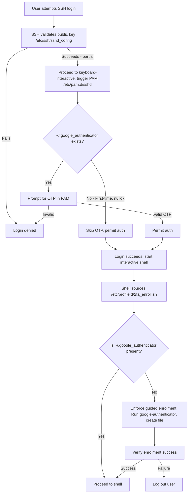
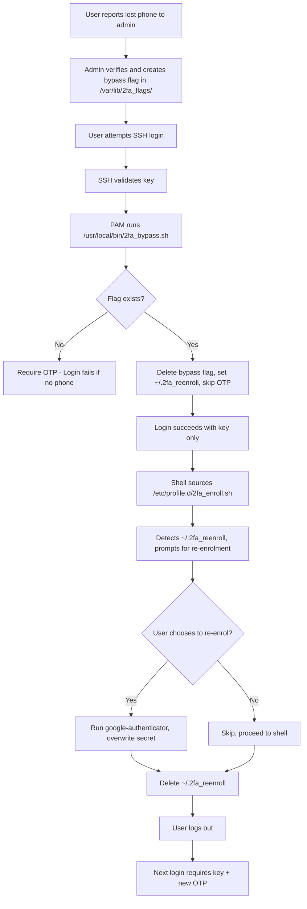

# С. Set Up SSH with 2FA (Key + OTP)

This role is aimed to setup and config the ubuntu server to use ssh key + OTP as 2FA.

## Prerequisite

I am not going to prepare a user/key in this role, bring your own key(BYOK).

_Please make sure your ubuntu user authorized key is setup before using this role._

Here is a quick snippet to create a sshkey and setup up the authorized key for ssh.

```sh
# In your host machine
ssh-keygen -t ed25519 -C "testuser"
# Copy the ~/.ssh/id_ed25519.pub content, paste it to your linux user ~/.ssh/authorized_key
```

## Feature

This role have 4 core feature

-   SSH only allow ssh key + OTP
-   Support self-enrolment, users can generate their OTP secret on first login.
-   Admin can temporarily disable 2FA for a user for a single login (in case of the user lost their OTP device)
-   The temporarily disabled 2FA user can re-enroll the OTP when they login

## How to use this role

You can run this role via the core provisioner playbook [readme.md](/README.md)

### First login

Assuming your user has the key setup already, you can now ssh to the server

```bash
ssh -i ~/.ssh/<your-key> testuser@<server-ip>
```

Then you should see the following message

```
=== 2FA Enrolment Required ===
Welcome! For security, you must set up 2FA now.
This will generate a QR code—scan it with Google Authenticator or Authy.
Save the emergency scratch codes shown— they're for recovery!
```

Press Enter, then you will being asked again

```
Do you want authentication tokens to be time-based (y/n) y
```

Type y, press enter, then a QR code will show in the terminal.
Use your Google Authenticator or other authenticator App to scan the QR code. Then type in the code

```
# Type your code shown in the App
Enter code from app (-1 to skip): 999999
```

Then it will ask you a few questions, the first question you must type `y`, for other up to user's preferences

```
Do you want me to update your "/home/testuser/.google_authenticator" file? (y/n) y

Do you want to disallow multiple uses of the same authentication
token? This restricts you to one login about every 30s, but it increases
your chances to notice or even prevent man-in-the-middle attacks (y/n) y

By default, a new token is generated every 30 seconds by the mobile app.
In order to compensate for possible time-skew between the client and the server,
we allow an extra token before and after the current time. This allows for a
time skew of up to 30 seconds between authentication server and client. If you
experience problems with poor time synchronization, you can increase the window
from its default size of 3 permitted codes (one previous code, the current
code, the next code) to 17 permitted codes (the 8 previous codes, the current
code, and the 8 next codes). This will permit for a time skew of up to 4 minutes
between client and server.
Do you want to do so? (y/n) n

If the computer that you are logging into isn't hardened against brute-force
login attempts, you can enable rate-limiting for the authentication module.
By default, this limits attackers to no more than 3 login attempts every 30s.
Do you want to enable rate-limiting? (y/n) y
Enrolment successful! Future logins require your OTP.
```

You are now logged in

### Next and future login

```bash
ssh -i ~/.ssh/<your-key> testuser@<server-ip>
# This will prompt and type your OTP code shown in the authenticator app
(testuser@localhost) Verification code:
```

### Admin temporarily disable 2FA for a user

```bash
# Admin using root account for simplicity
# And we are going to disable 2FA for user "testuser"
# Admin need to create a flag file
touch /var/lib/2fa_flags/testuser.bypass
# That's it
```

### User login after 2FA disabled

```bash
ssh -i ~/.ssh/<your-key> testuser@<server-ip>
```

You will be successfully logged in, and the following re-enrollment will prompt:

```
=== 2FA Recovery Mode ===
Admin has enabled a one-time bypass (e.g., for lost phone).
Your current OTP may not work.
Generate a new OTP secret now? (y/n):
```

Type y to recreate a OTP secret, or do it later via typing `google-authenticator` in the shell.

## How 2FA is enabled and how enrolment works

2FA is enabled by enforcing a two-stage authentication process in the SSH daemon configuration (`/etc/ssh/sshd_config`)
First, validation of the user's SSH public key, followed by a keyboard-interactive challenge handled by PAM (`/etc/pam.d/sshd`). The PAM setup requires a valid OTP from the Google Authenticator module (`pam_google_authenticator.so`), which reads the user's secret from ~/.google_authenticator. The 'nullok' option allows initial logins to skip OTP if no secret exists, enabling self-enrolment.

Enrolment is self-service on the first login:

Users log in with their SSH key only (due to nullok).
A system-wide script (`/etc/profile.d/2fa_enroll.sh`) then runs automatically during interactive shell startup, detecting if `~/.google_authenticator` is missing and prompting the user to run 'google-authenticator' to generate a secret and QR code. The script enforces completion with a loop, Ctrl+C trapping (to prevent interruptions), and a post-check that logs out the user if enrolment fails. Once enrolled, future logins require both key and OTP.



## How the bypass mechanism works

The bypass mechanism allows an administrator to temporarily disable OTP for a single login (e.g., for recovery if a user loses their phone). It's implemented via a PAM-exec module in /etc/pam.d/sshd, which runs a root-owned script (/usr/local/bin/2fa_bypass.sh). The admin creates a per-user flag file in the secure, root-only directory /var/lib/2fa_flags/ (e.g., /var/lib/2fa_flags/testuser.bypass). During login, the script checks for this flag: if present, it deletes the flag (one-time use), skips the OTP module, and sets a user-readable re-enrolment flag in the user's home (~/.2fa_reenroll).

Upon successful bypassed login, the enrolment script (/etc/profile.d/2fa_enroll.sh) detects the re-enrolment flag and prompts the user to generate a new OTP secret (optional, for recovery). The flag is auto-deleted after the prompt. This ensures secure, admin-controlled recovery without persistent changes.


